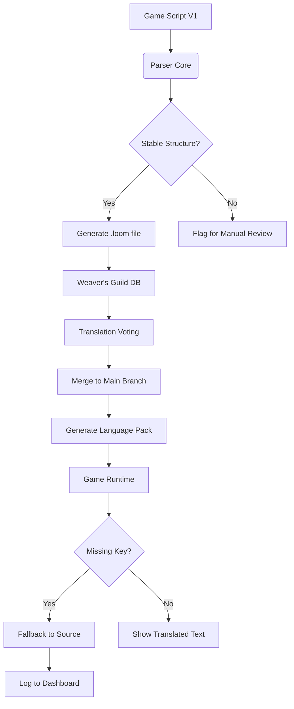

# Loreweave: The Polyglot Narrative Engine

**Loreweave** is not just another translation toolkit; it is a narrative consciousness for the digital age. Born from the spirit of community-driven storytelling, this project reimagines how interactive fiction and visual novel communities can collaborate across language barriers. While our inspirations lie in the rich tradition of fan-made mods and dedicated community ports, Loreweave is a completely new entity—a modular, self-hosted engine designed to weave disparate threads of dialogue, character arcs, and world-building lore into a single, harmonious tapestry that speaks every language.

## Overview

In the vast ocean of user-generated content, stories often remain trapped in the silos of their original dialects. Creators pour their hearts into branching plots, only to find their audience limited to a fraction of the global community. Loreweave approaches this problem not with brute-force machine translation, but with a sophisticated lattice of human-in-the-loop collaboration tools, version-controlled scriptlets, and a runtime that treats localization as a first-class citizen, not an afterthought.

Think of it as a cartography tool for the heart of your story. It maps every dialogue node, every choice consequence, and every emotional beat, allowing a global team of volunteer "weavers" to add threads of meaning without ever tangling the core codebase.

### Why "Weave"?

Because we don't just translate; we *interlace*. A direct translation often loses the cultural subtext of a joke or the specific weight of an honorific. Loreweave allows translators to attach context notes, cultural briefs, and alternative phrasings directly to the narrative nodes. The result is a port that feels native, not stitched on.

## Getting Started with the Loom

Before you begin your journey, ensure your environment has a stable runtime environment for Python-based utilities (version 3.10 or later) and a modern web browser for the management dashboard.

### Installation Type A: The Digital Archivist

If you wish to use Loreweave purely as an analysis and planning tool for your existing projects:

1. Download the *Core Weave Bundle* from the repository's release section.
2. Extract the archive to a directory of your choice (e.g., `~/Loreweave_Core`).
3. Execute the `loreweave_ui` binary within the extracted folder.
4. Navigate to `localhost:8080` in your browser to access the Loom Dashboard.

### Installation Type B: The Community Orchestrator

For creators who want to manage a full translation team with workflow approvals and version rollbacks:

1. Ensure you have a local database service (SQLite3 or Postgres) active.
2. Run the `setup_loom` script located at the root of this repository.
3. Follow the interactive prompts to designate a "Head Weaver" (admin) account.
4. Point your existing game engine (Ren'Py, Unity, etc.) to the Loreweave API endpoint for dynamic script injection.

## The Three Pillars of Loreweave

### 1. The Structural Loom
This is the core file parser. It analyzes your source game scripts and creates a virtual map of the narrative flow. Unlike simple string extraction, the Loom understands conditional branches, variable states, and looping segments. It identifies "narrative islands"—sections of text that are risky to translate without broader context. It then generates a `.loom` file, a schema that defines every string, its type (dialogue, internal monologue, UI label, or system message), and its dependencies.

### 2. The Weave API
This is the communication layer. It allows your game to request localized content on the fly. The magic lies in its **Adaptive Substitution** logic. If a specific translation node is incomplete (e.g., a Spanish translation for a rant about the weather is pending), the API falls back to a generic source language string but flags it in your dashboard, ensuring your game never crashes with a missing key.

### 3. The Weaver's Guild
A collaborative platform built into the dashboard. Here, translators can see a timeline of changes, suggest "Subjective Equivalents" (phrases that capture the *spirit* of the original, not just the words), and vote on the best translation for ambiguous terms. This transforms translation from a solitary chore into a community-building experience.

## Why This Isn't Just Another Port Project

We observed that many modding communities stop at a simple `.rpy` translation. They hit a wall when the original code updates, breaking their translation patches. Loreweave solves this with a **Fractal Versioning System**. We don't store full lines of translated text; we store *deltas* and *anchors*. When an upstream update occurs, Loreweave identifies which anchor points have shifted and automatically re-applies the translation logic to the new structure, if the context is unchanged.

### Responsive UI & Accessibility
The dashboard is built on a flexible grid system, ensuring that a community moderator on a tablet has the same control as a developer on a 4K monitor.

### Multilingual Support at its Core
Our schema supports right-to-left scripts, non-Latin Unicode ranges, and even constructed languages, ensuring that your story retains its unique voice whether spoken in English, Spanish, Mandarin, or Klingon.

### 24/7 Community Assistance
While we don't offer a "helpline," our Discord server and issue tracker are monitored by a dedicated group of core contributors who believe that no weaver should be left stranded.

## Dashboard Features

- **Heatmaps:** See which chapters have the most untranslated strings.
- **Dual-View Editing:** Side-by-side source and translation text with inline comments.
- **Audit Logs:** Full transparency on who changed what and when.
- **Export Wizards:** Generate specific patches for engine versions without exposing the whole `.loom` file.

## Roadmap for 2026

We are currently working on a **Machine-Assisted Suggestion Engine** that will use statistical context matching to offer translators a draft translation, which they can then accept, reject, or modify. This is not meant to replace human creativity, but to accelerate the initial pass.

### Upcoming Milestones
- **Q1 2026:** Release of the `WeaveAPI 2.0` with support for dynamic audio cue localization.
- **Q2 2026:** Introduction of the "Cultural Consultant" role, allowing users to add specific notes on titles and honorifics.
- **Q3 2026:** Integration with popular cloud storage for team-based loom files.
- **Q4 2026:** Large-scale stress testing with a fictional 500,000-word visual novel to ensure performance.

## The Philosophy Behind the Code

We believe that a story told in a language you understand is a story you *read*. But a story told in your native dialect, with the right local idioms and cultural references, is a story you *feel*. Loreweave aims to be the bridge between those two states. It's a gift to the creators who pour their souls into interactive worlds and the players who seek to experience them truly unshackled.

### A Note on Efficiency
We are not about cutting corners. We are about creating straight lines where there used to be labyrinths. The complexity of our versioning system means that in the long run, maintaining a translation is 80% less cumbersome than traditional text replacement methods.

## Contributing to the Tapestry

Whether you are a writer, a programmer, or a polyglot, there is a space for you here. Your contributions help break down the walls of language, one thread at a time.

- **Creators:** Share your game hooks so we can build better adapters.
- **Translators:** Join the Guild to start weaving your native tongue.
- **Developers:** Dive into the plugin architecture to build support for new game engines.

## Disclaimer

**Loreweave** is an independent, open-source project. It is not affiliated with, endorsed by, or sponsored by any specific game studio or visual novel publisher. All product names, logos, and brands are property of their respective owners. Use of this tool is at your own risk; we are not responsible for any data loss or narrative inconsistencies that may occur during the weaving process. This project is provided "as is" without warranty of any kind.

## License

This project is licensed under the MIT License - see the [LICENSE](LICENSE) file for details. You are free to use, modify, and distribute this software, provided that the original copyright notice and permission notice are included in all copies or substantial portions of the Software.

## Closing the Loop

We've seen what happens when communities unite behind a story. We've seen characters become beloved across the globe because a small group of dedicated fans took the time to bridge a linguistic gap. This is an ode to those unsung heroes, and an attempt to give them better tools.

---

**Join the Conversation**
We value your feedback. If you have ideas for new features, or if you encounter a snag in the loom, please open an issue in the repository. Let's make translation a journey of discovery, not a chore of compensation.

**Final Thoughts**
The world is full of stories waiting to be told. Don't let a language barrier be the lock on the door. Weave the key.

